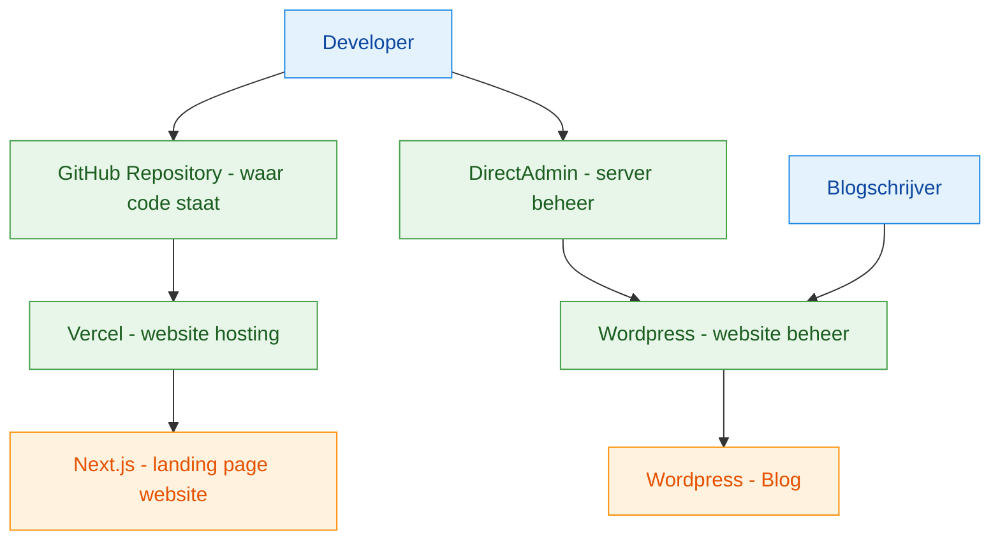

# LFHS Website

Moderne kerkwebsite landing page, naast bestaande aparte blog. In feite dus twee volledig aparte websites, met voorkeur voor een aparte blog-subdomain:
* nieuwe website voor **landing page**: gebouwd met *Next.js* en gehost op *Vercel*
* oude website voor de **blog**: gebouwd met *Wordpress* en gehost op *Vimexx*

## Tech Stack

| Onderdeel | Technologie |
|---|---|
| Frontend | Next.js (Static Export) |
| Hosting & CDN | Vercel (Global Edge Network) |
| SSL | Automatisch via Let's Encrypt |
| DNS | Vimexx |
| Blog | WordPress op Vimexx Hosting |
| Database (blog) | MySQL (via Vimexx) |

## Routing & Security

- **Voorkeursrouting**: `blog.kerk.nl` wijst direct naar WordPress op Vimexx
- **Fallback routing**: `/blog` alleen gebruiken als subdomain-routing niet haalbaar is, via proxy of rewrites
- **CSP aanpak**: nonce-based Content Security Policy, dus geen `'unsafe-inline'`
- **Implementatie-opmerking**: bouw de CSP per request op in middleware, edge of reverse proxy; zet dit niet als vaste header-string in `next.config.ts`

## Architectuur



🔵 Mensen
🟢 Platform
🟠 Website

## Hoe werkt de deployment?

1. De developer pusht code naar de **GitHub repository**
2. Vercel detecteert de push en start automatisch een **build**
3. Next.js genereert statische bestanden (HTML/CSS/JS) via `next export`
4. De statische bestanden worden uitgerold naar Vercel's **globaal CDN** (100+ edge locaties)
5. Bezoekers worden via DNS (Vimexx) naar het dichtstbijzijnde CDN-punt gerouteerd

## DNS Configuratie (Vimexx)

Voorkeur:
- hoofdsite via Vercel
- blog via `blog.kerk.nl` naar WordPress

Fallback:
- `/blog` via proxy/rewrite als een apart subdomein niet mogelijk is

| Record | Waarde | Doel |
|---|---|---|
| `A` / `CNAME` (root) | `cname.vercel-dns.com` | Hoofdsite → Vercel |
| `CNAME` (www) | `cname.vercel-dns.com` | www → Vercel |
| `A` of `CNAME` (blog) | Vimexx IP / WordPress host | `blog.kerk.nl` → WordPress |

## Lokaal ontwikkelen

```bash
# Dependencies installeren
npm install

# Development server starten
npm run dev

# Productie build testen
npm run build
npm run start
```

## Projectdoelstellingen

- **Prestaties**: Lighthouse score 95–100, sub-seconde laadtijden
- **Kosten**: €0–5/maand (Vercel Free Tier)
- **Veiligheid**: Minimaal aanvalsoppervlak dankzij statische bestanden
- **Beheer**: WordPress voor contentbeheer blog door niet-technische teamleden
