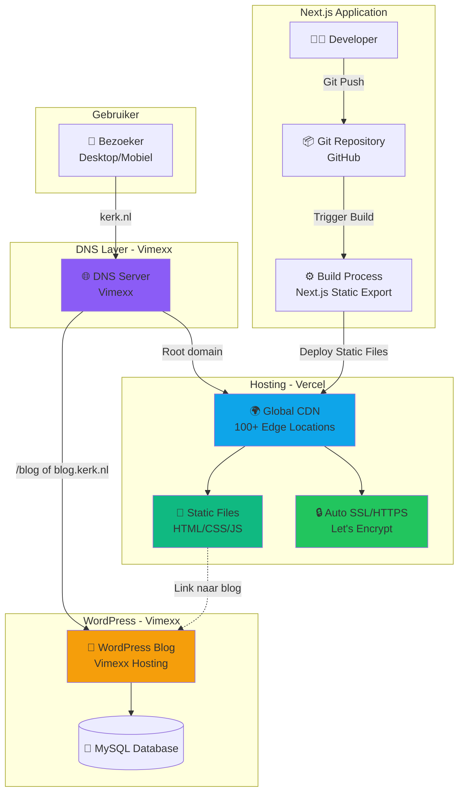

# LFHS Website

Moderne kerkwebsite gebouwd met **Next.js** en gehost op **Vercel**, met een aparte WordPress-blogomgeving op Vimexx.

## Tech Stack

| Onderdeel | Technologie |
|---|---|
| Frontend | Next.js (Static Export) |
| Hosting & CDN | Vercel (Global Edge Network) |
| SSL | Automatisch via Let's Encrypt |
| DNS | Vimexx |
| Blog | WordPress op Vimexx Hosting |
| Database (blog) | MySQL (via Vimexx) |

## Architectuur



## Hoe werkt de deployment?

1. De developer pusht code naar de **GitHub repository**
2. Vercel detecteert de push en start automatisch een **build**
3. Next.js genereert statische bestanden (HTML/CSS/JS) via `next export`
4. De statische bestanden worden uitgerold naar Vercel's **globaal CDN** (100+ edge locaties)
5. Bezoekers worden via DNS (Vimexx) naar het dichtstbijzijnde CDN-punt gerouteerd

## DNS Configuratie (Vimexx)

| Record | Waarde | Doel |
|---|---|---|
| `A` / `CNAME` (root) | `cname.vercel-dns.com` | Hoofdsite → Vercel |
| `CNAME` (www) | `cname.vercel-dns.com` | www → Vercel |
| `A` of `CNAME` (blog) | Vimexx IP / subdomein | Blog → WordPress |

## Lokaal ontwikkelen

```bash
# Dependencies installeren
npm install

# Development server starten
npm run dev

# Productie build testen
npm run build
npm run start
```

## Projectdoelstellingen

- **Prestaties**: Lighthouse score 95–100, sub-seconde laadtijden
- **Kosten**: €0–5/maand (Vercel Free Tier)
- **Veiligheid**: Minimaal aanvalsoppervlak dankzij statische bestanden
- **Beheer**: WordPress voor contentbeheer blog door niet-technische teamleden
